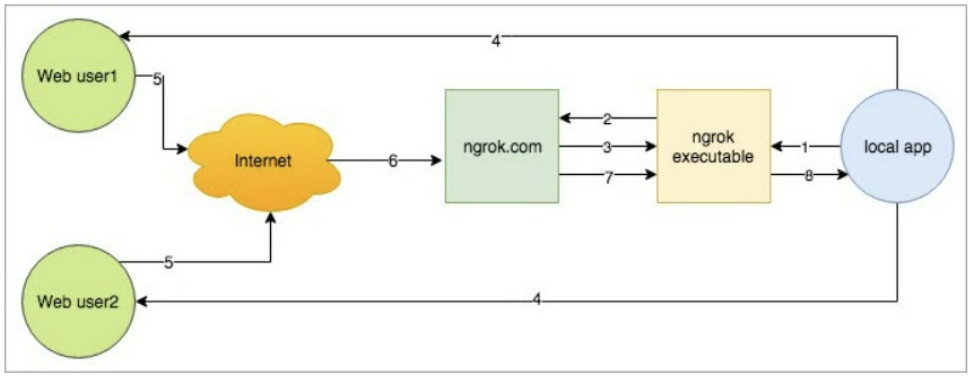
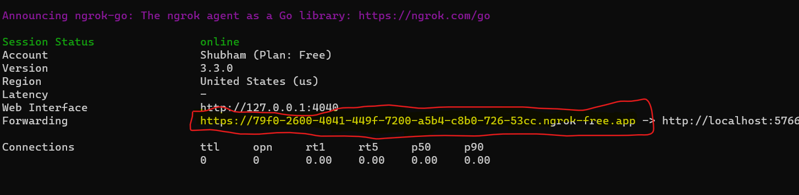
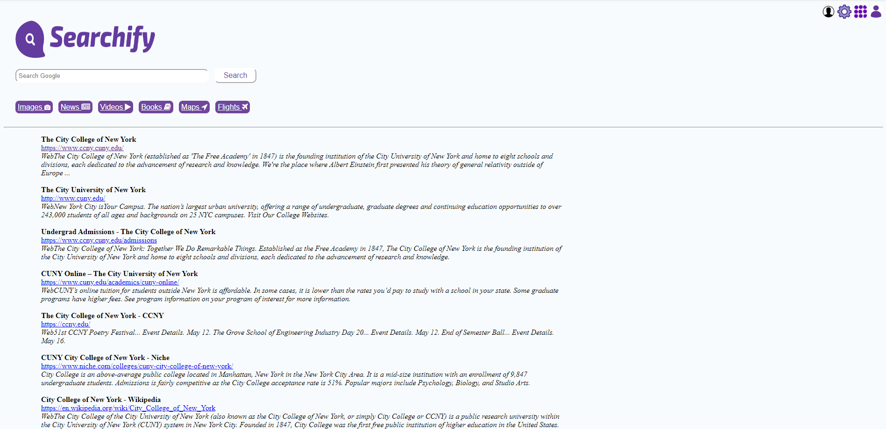

# Searchify
"Experience the future of search with Searchify - where advanced algorithms and intuitive design converge to deliver unparalleled search results."

Overall, this project involves a combination of web scraping, API integration, 
database management, and web development. It requires a strong understanding of Python, 
Flask, MySQL, and Ngrok, as well as knowledge of how search engines and web applications work.

### Installation

 requires [python](https://www.python.org/download/releases/3.0/) v3(3.7.9) to run.


Installing required packages
```sh
$ pip install -r requirement.txt
```


### Run Application


For running SQL Server,


```sh
$ mysql -u root -p
```


```sh
$ python frontEnd.py
```


Web Hosting Using Ngrok

```sh

To get api key login to "https://dashboard.ngrok.com/get-started/your-authtoken"
and run below command

ngrok config add-authtoken <api key>

```


```sh
$ 1. Unzip the file in uitls directory

  2. Run the ngrok file on command line
  
  3. Run the file app.py
  
  4. Take the port number where the app.py is hosted. You can find that port number on the
   terminal where you are running the app.py. ex- "localhost:5677"
   
  5. Use that port and run the command "ngrok http <port number>" on command line which we run in step 2.
  
  6. The ngrok will create a pipline where it will give you the
   public url(marked below) where they have exposed our local application.
   
```



For running the hosted app

```sh
$ python app.py
```

Home page


Result Page
